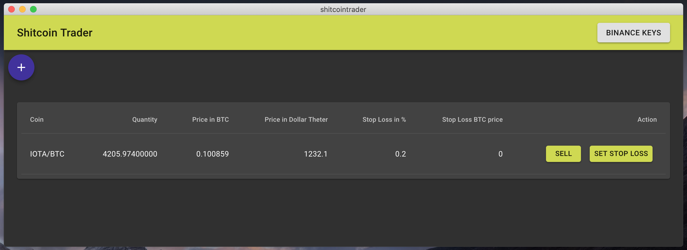
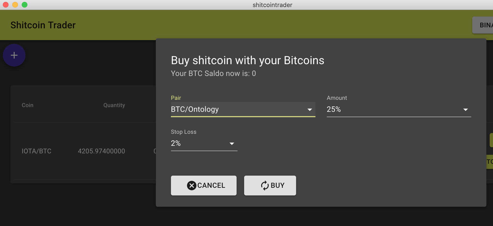
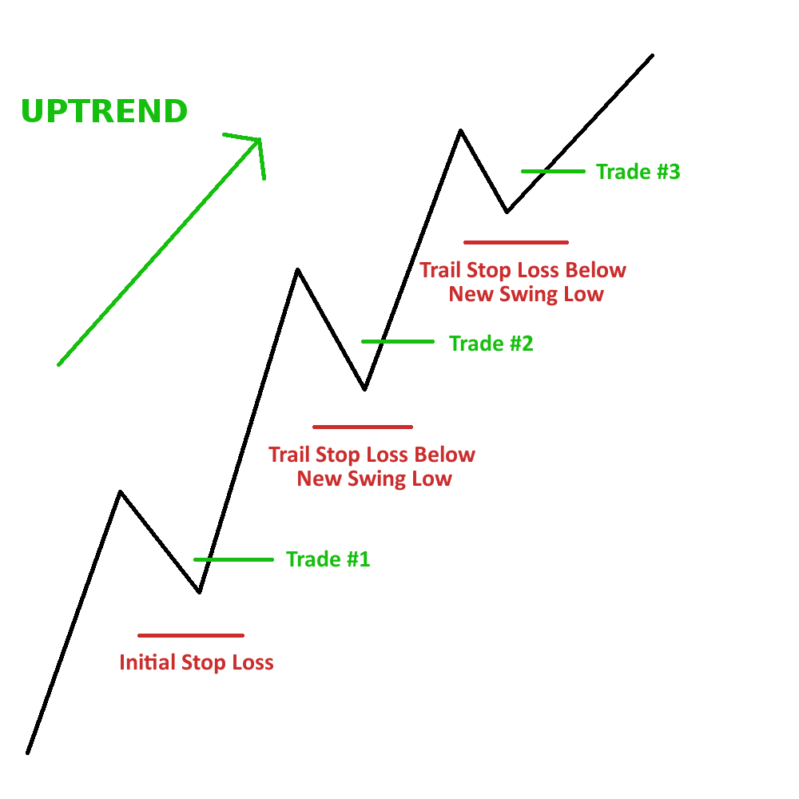

 

  

 

# shitcointrader

⚡This desktop app is basically a wrapper of an usual exchange, eliminating the confusing options to make a simple trade.

⚡Shitcointrader allows you buy shitcoins (alternative coins) using your Bitcoins located in your Binance Wallet and sets automatically a stop loss.

⚡The stoploss price is automatically updated when the price goes up.

# Icons license
“Designed by [[author link](https://www.freepik.com/)] from www.flaticon.com” and is licensed by Creative Commons BY 3.0 from @flaticon”).